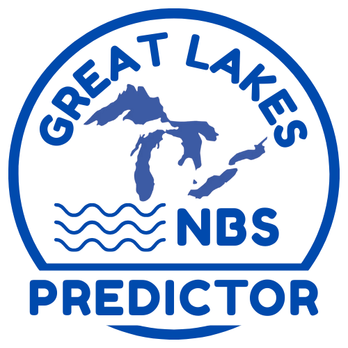

# cnbs-predictor

<p align="center">
  
</p>

## Overview
Welcome to cnbs-predictor! This software package is designed to forecast key components of Net Basin Supply (NBS) for the Laurentian Great Lakes using atmospheric forecast data. At present, it uses NOAA's Climate Forecast System (CFS) data to forecast precipitation, evaporation, and runoff nine months into the future at monthly intervals.

### Features
- Advanced Predictive Algorithms: Leverages methods like Gaussian Processes for data-driven forecasting.
- Real-Time Data Processing: Integrates live forecast data for up-to-date predictions.
- User-Friendly Interface: Streamlined setup and interactive notebooks for ease of use.
- Continuous Improvements: Regular updates to enhance features, performance, and modeling capabilities.

### Target
Forecast precipitation, evaporation, and runoff, which are the components net basin supply (NBS), for all Laurentian Great Lakes nine months into the future at monthly intervals. 

### Inputs
- Data Source: NOAA forecast data from the Climate Forecast System (CFS), which must be downloaded and preprocessed before a forecast can be generated. This repository contains notebooks for carrying out this downloading and preprocessing. 
- Required Datasets: Please refer to the 'Data Sources' section below for specific files and data organization.

### Data Sources

| Abbreviation | Name                                           | Source             |
|--------------|------------------------------------------------|--------------------|
| CFS          | Climate Forecast System v2                     | NOAA               |
| LS2SWBM      | Large Lake Statistical Water Balance Model     | NOAA GLERL         |

## Getting Started

### Prerequisites
Before you begin, make sure that the following are installed on your system:

- Conda (Anaconda or Miniconda)
- Python 3.9+

### Installation
1. **Clone the Repository:** Clone the repository to your target machine.

    ```bash
    git clone https://github.com/great-lakes-ai-lab/cnbs-predictor.git
    cnbs-predictor
    ```

2. **Set Up the Conda Environment**: Create and activate the Conda environment. (NOTE: THIS MAY BE DIFFERENT FOR TRAINING VS. PREDICTION) 

    ```bash
    conda env create -f requirements/environment.yml
    conda activate cnbs-predictor-env
    ```

3. **Set Up Jupyter Kernel**: Register the Conda environment as a Jupyter kernel.

    ```bash
    python -m ipykernel install --user --name cnbs-predictor-env --display-name "Python (cnbs-predictor-env)"
    ```

### Usage

#### Running Jupyter Lab

After setting up your Conda environment, you can launch **Jupyter Lab** to work with the notebooks. 

```bash
jupyter lab
```

#### Working with Notebooks
1. After starting Jupyter Lab, a new browser window should open.
2. Navigate to the notebooks/production/ directory.
3. Open the appropriate notebook (e.g., 2_LEF_forecast_model.ipynb). Note that there are separate notebooks for:
    - Forecast model training (not needed for most users), 
    - Downloading and preprocessing input data from NOAA CFS and other sources, and 
    - Generating forecasts. 
4. Set your directory paths in the "User Input" section.
5. Run the notebook to generate forecasts.

## Project Structure

```graphql
cnbs-predictor/
├── CODE_OF_CONDUCT.md      # Code of conduct for contributors
├── LICENSE                 # Project license
├── docs/                   # Sphinx-based documentation (coming soon)
├── README.md               # Project README file
├── requirements/           # Conda environment requirements
├── src/                    # Source code for data processing and utilities
│   ├── __init__.py         # Package initialization
│   ├── data_processing.py  # Functions for data processing
│   ├── database_utils.py   # Database utility functions
│   ├── hydro_utils.py      # Hydrology-related utilities
├── tests/                  # Unit tests for the codebase
├── notebooks/              # Jupyter notebooks
│   ├── exploratory/        # Initial exploration notebooks
│   ├── production/         # Production-ready notebooks (use these to produce forecasts)
│   └── verification/       # Notebooks for testing and validation
├── data/                   # Directory for storing input data
│   ├── cfs/                # Archived CFS forecast data
│   ├── forecast/           # Forecast files (database, html viewer)
│   ├── glcc/               # GLCC target data
│   ├── input/              # Input data (database, trained model weights)
│   ├── l2swbm/             # L2SWBM target data
│   └── training/           # Training data
```

## Contributing
We welcome contributions to cnbs-predictor! Please start a discussion with the maintainers first, either in the GitHub Discussions area of this repository or via email. Once you have discussed possible changes with the developers:

1. Fork the repository.
2. Clone your fork to your target machine.
3. Create a feature branch for your changes.
4. Make and commit your changes.
5. Push your branch to your fork.
6. Submit a pull request to the main repository.

For detailed contributing instructions, please refer to the [Contributing guidelines](CONTRIBUTING.md). For a summary of current development plans to help map out possible contributions, see our [Roadmap document](ROADMAP.md).

## Code of Conduct

This project adheres to a [Code of Conduct](CODE_OF_CONDUCT.md). By participating, you agree to follow this code and foster a welcoming and respectful community.

## License

This project is licensed under the [GNU Affero General Public License Version 3.0](LICENSE).