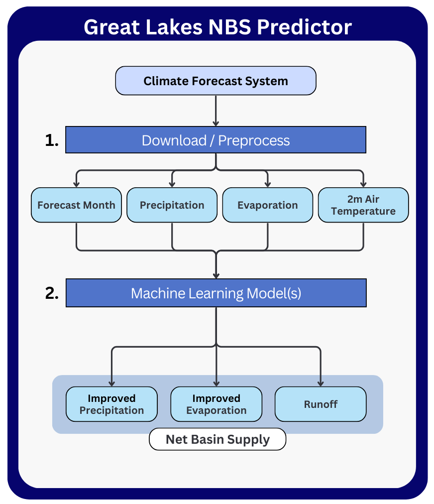

# cnbs-predictor


<p align="center">
  
</p>

## Overview
Welcome to cnbs-predictor! This software package is designed to forecast key components of Net Basin Supply (NBS) for the Laurentian Great Lakes using atmospheric forecast data. At present, it uses NOAA's Climate Forecast System (CFS) data to forecast precipitation, evaporation, and runoff nine months into the future at monthly intervals.

<p align="center">
  
</p>

### Features
- Advanced Predictive Algorithms: Leverages methods like Gaussian Processes for data-driven forecasting.
- Real-Time Data Processing: Integrates live forecast data for up-to-date predictions.
- User-Friendly Interface: Streamlined setup and interactive notebooks for ease of use.
- Continuous Improvements: Regular updates to enhance features, performance, and modeling capabilities.

### Target
Forecast precipitation, evaporation, and runoff, which are the components net basin supply (NBS), for all Laurentian Great Lakes nine months into the future at monthly intervals. 

### Inputs
- Data Source: NOAA forecast data from the Climate Forecast System (CFS), which must be downloaded and preprocessed before a forecast can be generated. This repository contains notebooks for carrying out this downloading and preprocessing. 
- Required Datasets: Please refer to the 'Data Sources' section below for specific files and data organization.

### Data Sources

| Abbreviation | Name                                           | Source             |
|--------------|------------------------------------------------|--------------------|
| CFS          | Climate Forecast System v2                     | NOAA               |
| LS2SWBM      | Large Lake Statistical Water Balance Model     | NOAA GLERL         |

## Getting Started

### Prerequisites
Before you begin, make sure that the following are installed on your system:

- Conda (Anaconda or Miniconda)
- Python 3.9+

### Installation
1. **Clone the Repository:** Clone the repository to your target machine.

    ```bash
    git clone https://github.com/great-lakes-ai-lab/cnbs-predictor.git
    cd cnbs-predictor
    ```

2. **Set Up the Conda Environment**: Create and activate the Conda environment. 

    ```bash
    conda env create -f requirements/cnbs_env.yaml
    conda activate cnbs_env
    ```

3. **Set Up Jupyter Kernel**: Register the Conda environment as a Jupyter kernel.

    ```bash
    python -m ipykernel install --user --name cnbs_env --display-name "Python (cnbs_env)"
    ```

### Usage

This section guides you on how to interact with the project's Jupyter notebooks.

#### Running Jupyter Lab in a Web Browser

After setting up your Conda environment, you can launch **Jupyter Lab** to work with the notebooks in your default web browser.

```bash
jupyter lab
```

This command will typically open Jupyter Lab in a new tab or window in your default web browser. If it doesn't open automatically, look for URLs printed in your terminal (e.g., `http://localhost:8888/lab?token=...`) and copy-paste one into your browser.

**Troubleshooting Note:** If you encounter a `Jupyter command 'jupyter-lab' not found` error after activating the environment, it's likely a temporary installation issue. You can manually install it with:

```bash
conda install jupyterlab
```

Then retry `jupyter lab`.

#### Running Jupyter Lab Desktop Application

If you prefer to use the standalone **JupyterLab Desktop** application for a native desktop experience:

1.  **Install JupyterLab Desktop:** If you haven't already, download and install the application, for example from the [official JupyterLab Desktop website](https://github.com/jupyterlab/jupyterlab-desktop/releases) or through your organization's trusted software portal.
2.  **Open JupyterLab Desktop:** Launch the application.
3.  **Add Conda Environment:**
    * In the JupyterLab Desktop application, go to `File` > `Add Existing Environment...` or navigate through `Settings` > `Python Environment Manager` > `Add Existing`.
    * You will need to point it to your `cnbs_env` Conda environment's Python executable. The typical paths are:
        * **macOS/Linux:** `/path/to/your/miniconda3/envs/cnbs_env/bin/python`
        * **Windows:** `C:\path\to\your\miniconda3\envs\cnbs_env\python.exe`
        (Remember to replace `/path/to/your/miniconda3` with your actual Anaconda or Miniconda installation directory.)
    * Give it a descriptive display name like "Python (cnbs_env)".
4.  **Launch from Desktop:** Once `cnbs_env` is added and selected, you can navigate to your cloned `cnbs-predictor` directory within the JupyterLab Desktop interface and open the notebooks.

#### Running in VS Code

For a powerful integrated development environment (IDE) experience with features like variable explorers, debugging, and integrated Git, you can use **Visual Studio Code** with its Python and Jupyter extensions.

1.  **Install VS Code:** If you haven't already, download and install [Visual Studio Code](https://code.visualstudio.com/).
2.  **Install Extensions:** Open VS Code and install the recommended extensions:
    * **Python Extension** (Publisher: Microsoft)
    * **Jupyter Extension** (Publisher: Microsoft)
    You can find and install extensions from the Extensions view (`Ctrl+Shift+X` or `Cmd+Shift+X`).
3.  **Open Project Folder:** In VS Code, go to `File` > `Open Folder...` and select your cloned `cnbs-predictor` directory.
4.  **Select Conda Environment (Kernel):**
    * Open any `.ipynb` notebook file in VS Code (e.g., `notebooks/production/2_LEF_forecast_model.ipynb`).
    * In the top right corner of the notebook editor, click on the **kernel picker** (it might show a Python version or "Select Kernel").
    * From the list, select "Python Environments..." and then choose the `cnbs_env` Conda environment. VS Code typically auto-detects your Conda environments.
    * Alternatively, you can open the Command Palette (`Ctrl+Shift+P` or `Cmd+Shift+P`), type "Python: Select Interpreter", and choose your `cnbs_env` Python executable from the detected list.
5.  **Run Notebook Cells:** Once the `cnbs_env` kernel is selected, you can run cells directly within VS Code's integrated notebook editor.

#### Working with Notebooks

Regardless of how you launched Jupyter Lab (browser, desktop app, or VS Code), the process for working with the notebooks is the same:

1.  Navigate to the `notebooks/production/` directory.
2.  Open the appropriate notebook (e.g., `2_LEF_forecast_model.ipynb`). Note that there are separate notebooks for:
    * Forecast model training (not needed for most users),
    * Downloading and preprocessing input data from NOAA CFS and other sources, and
    * Generating forecasts.
3.  Set your directory paths in the "User Input" section within the notebook.
4.  Run the notebook cells to generate forecasts.

## Project Structure

```graphql
cnbs-predictor/
├── CODE_OF_CONDUCT.md      # Code of conduct for contributors
├── LICENSE                 # Project license
├── docs/                   # Sphinx-based documentation (coming soon)
├── README.md               # Project README file
├── requirements/           # Conda environment requirements
├── src/                    # Source code for data processing and utilities
│   ├── __init__.py         # Package initialization
│   ├── data_processing.py  # Functions for data processing
│   ├── database_utils.py   # Database utility functions
│   ├── hydro_utils.py      # Hydrology-related utilities
├── tests/                  # Unit tests for the codebase
├── notebooks/              # Jupyter notebooks
│   ├── exploratory/        # Initial exploration notebooks
│   ├── production/         # Production-ready notebooks (use these to produce forecasts)
│   └── verification/       # Notebooks for testing and validation
├── data/                   # Directory for storing input data
│   ├── cfs/                # Archived CFS forecast data
│   ├── forecast/           # Forecast files (database, html viewer)
│   ├── glcc/               # GLCC target data
│   ├── input/              # Input data (database, trained model weights)
│   ├── l2swbm/             # L2SWBM target data
│   └── training/           # Training data
```

## Contributing
We welcome contributions to cnbs-predictor! Please start a discussion with the maintainers first (@lefitzpatrick, @danijonesocean), preferably in the GitHub Discussions or Issues sections of this repository. Once you have discussed possible changes with the developers:

1. Fork the repository.
2. Clone your fork to your target machine.
3. Create a feature branch for your changes.
4. Make and commit your changes.
5. Push your branch to your fork.
6. Submit a pull request to the main repository.

For detailed contributing instructions, please refer to the [Contributing guidelines](CONTRIBUTING.md). For a summary of current development plans to help map out possible contributions, see our [Roadmap document](ROADMAP.md).

## Code of Conduct

This project adheres to a [Code of Conduct](CODE_OF_CONDUCT.md). By participating, you agree to follow this code and foster a welcoming and respectful community.

## License

This project is licensed under the [GNU Affero General Public License Version 3.0](LICENSE).

## Acknowledgements

`cnbs-predictor` is powered by institutional collaboration from:


Funding for this project provided by NOAA
