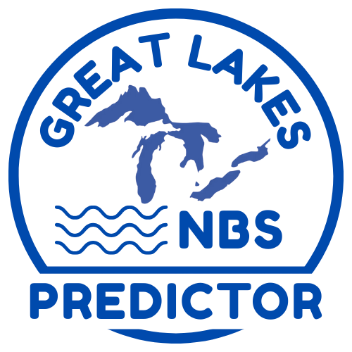
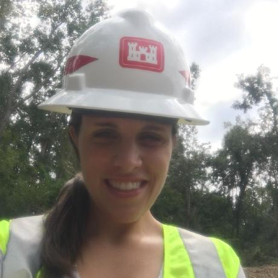
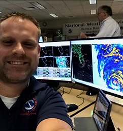
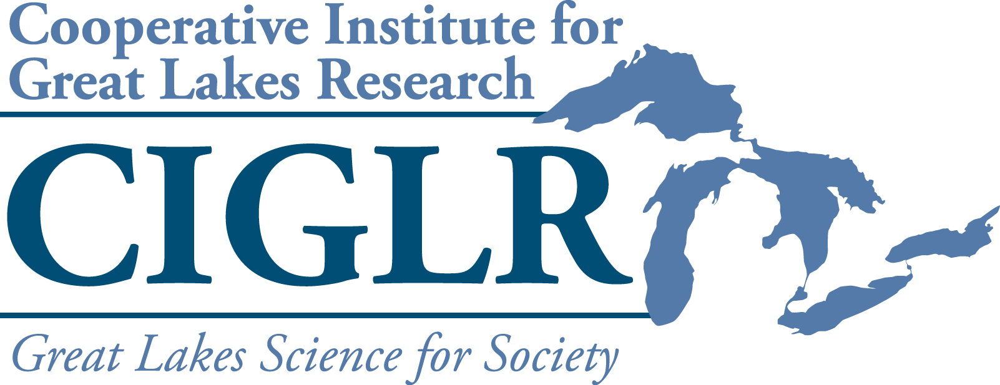
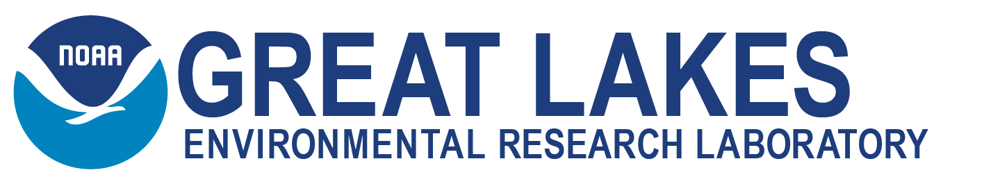

# nbs-predictor


[](https://cnbs-predictor.readthedocs.io/en/latest/)

<p align="center">
  
</p>

## Overview
Welcome to nbs-predictor! This software package is designed to forecast key components of Net Basin Supply (NBS) for the Laurentian Great Lakes using atmospheric forecast data. At present, it uses NOAA's Climate Forecast System (CFS) data to forecast precipitation, evaporation, and runoff nine months into the future at monthly intervals.

### Features
- Advanced Predictive Algorithms: Leverages methods like Gaussian Processes for data-driven forecasting.
- Real-Time Data Processing: Integrates live forecast data for up-to-date predictions.
- User-Friendly Interface: Streamlined setup and interactive notebooks for ease of use.
- Continuous Improvements: Regular updates to enhance features, performance, and modeling capabilities.

### Targets
Forecast precipitation (P), evaporation (E), runoff (R), and net basin supply (NBS) for all of the Laurentian Great Lakes up to twelve (12) months into the future at monthly intervals. By forecasting NBS directly, rather than deriving it from the individual component forecasts—we reduce the accumulation of error and improve overall forecast reliability.

### Inputs
- Data Source: NOAA forecast data from the Climate Forecast System (CFS), which must be downloaded and preprocessed before generating forecasts. Additionally, sea surface temperatures from GLSEA are required as initial conditions. This repository includes notebooks to handle both downloading and preprocessing of both datasets. 
- Required Datasets: Please refer to the 'Data Sources' section below for specific files and data organization.

### Data Sources

| Abbreviation | Name                                           | Source         | Data Use        |
|--------------|------------------------------------------------|----------------|----------------|
| CFSR         | Climate Forecast System Reanalysis             | NOAA           | Training       |
| CFS          | Climate Forecast System v2                     | NOAA           | Forecasting    |
| GLSEA        | Great Lakes Surface Environmental Analysis     | NOAA GLERL     | Forecasting |
| LS2SWBM      | Large Lake Statistical Water Balance Model     | NOAA GLERL     | Training    |
| GLCC         | Great Lakes Coordinating Committee             |                | Training |


## Getting Started

### Prerequisites
Before you begin, make sure that the following are installed on your system:

- Conda (Anaconda or Miniconda)
- Python 3.11+

### Installation  

On a **Mac**, begin by opening a **Terminal** window.  
On a **Windows** computer, you will need to open the **Anaconda Prompt**.  
- If you don’t already have Anaconda or Miniconda installed, download and install it from: https://www.anaconda.com/download  

1. **Clone the Repository:** Clone the repository to your target machine.

    ```bash
    git clone https://github.com/great-lakes-ai-lab/cnbs-predictor.git
    ```
    ```bash
    cd cnbs-predictor
    ```

2. **Set Up the Conda Environment**: Create and activate the Conda environment. 

    ```bash
    conda env create -f requirements/environment.yml
    ```
    ```bash
    conda activate nbs_env
    ```

3. **Set Up Jupyter Kernel**: Register the Conda environment as a Jupyter kernel.

    ```bash
    python -m ipykernel install --user --name nbs_env --display-name "Python (nbs_env)"
    ```

### Usage

#### Running Jupyter Lab

After setting up your Conda environment, you can launch **Jupyter Lab** to work with the notebooks. 

```bash
jupyter lab
```

#### Working with Notebooks
1. After starting Jupyter Lab, a new browser window should open.
2. Navigate to the notebooks/production/ directory.
3. Open the appropriate notebook (e.g., 2_LEF_forecast_model.ipynb). Note that there are separate notebooks for:
    - Forecast model training (not needed for most users), 
    - Downloading and preprocessing input data from NOAA CFS and other sources, and 
    - Generating forecasts. 
4. Set your directory paths in the "User Input" section.
5. Run the notebook to generate forecasts.

## Project Structure

```graphql
cnbs-predictor/
├── CODE_OF_CONDUCT.md                          # Code of conduct for contributors
├── CONTRIBUTING.md                             # Project license
├── data                                        # Directory for storing input data
│   ├── cfs                                     # Archived pre-processed CFS data
|   ├── cfsr                                    # Archived pre-processed CFSR data used for training
│   ├── glcc                                    # NBS Observations from GLCC used for training and validation
│   ├── glsea                                   # GLSEA Sea Surface Temperatures for the Great Lakes
│   ├── input                                   # Model inputs for forecasting (ML models, scalers, masks, etc.)
│   ├── l2swbm                                  # L2SWBM target data (P, E, R)
│   ├── probabilities                           # Probability files from USACE (update as needed) 
├── docs                                        # Documents
├── forecast                                    # Folder to save the forecast output
│   └── figures                                 # Forecast figures
├── LICENSE                                     # Project license
├── notebooks                                   # Jupyter notebooks
│   ├── exploratory                             # Initial exploration and additionally helpful notebooks
│   ├── production                              # Production-ready notebooks (use these to produce forecasts)
│   └── verification                            # Notebooks used for verification and validation
├── README.md                                   # Project README file
├── requirements                                # Conda environment requirements
├── ROADMAP.md                                  # Release schedule and CI/CD implementation plan
├── src                                         # Source code for data processing and utilities
└── tests                                       # Tests for the codebase
    ├── integration                             # Integration tests for testing multiple components
    └── unit                                    # Unit tests for quick testing of functions and data availability
```

## Contributing
We welcome contributions to cnbs-predictor! Please start a discussion with the maintainers first (@lefitzpatrick, @danijonesocean), preferably in the GitHub Discussions or Issues sections of this repository. Once you have discussed possible changes with the developers:

1. Fork the repository.
2. Clone your fork to your target machine.
3. Create a feature branch for your changes.
4. Make and commit your changes.
5. Push your branch to your fork.
6. Submit a pull request to the main repository.

For detailed contributing instructions, please refer to the [Contributing guidelines](CONTRIBUTING.md). For a summary of current development plans to help map out possible contributions, see our [Roadmap document](ROADMAP.md).

## Code of Conduct

This project adheres to a [Code of Conduct](CODE_OF_CONDUCT.md). By participating, you agree to follow this code and foster a welcoming and respectful community.

## License

This project is licensed under the [GNU Affero General Public License Version 3.0](LICENSE).

## Acknowledgements

### Contributors

<table>
  <tr>
    <td align="center">
      <a href="https://github.com/DaniJonesOcean">
        <br/>
        <b>Dani Jones</b>
      </a>
      <br/>
      Principal Investigator
    </td>
    <td align="center">
      <a href="https://github.com/lefitzpatrick">
        <br/>
        <b>Lindsay Fitzpatrick</b>
      </a>
      <br/>
      Model Developer
    </td>
    <td align="center">
      <a href="https://github.com/DeannaApps">
        <br/>
        <b>Deanna Fielder</b>
      </a>
      <br/>
      Model Testing
    </td>
    <td align="center">
      <a href="https://github.com/jamiewa139">
        <br/>
        <b>Jamie Ward</b>
      </a>
      <br/>
      Model Testing
    </td>
  </tr>
  <tr>
    <td align="center">
      <a href="https://github.com/pjhopp19">
        <br/>
        <b>Trece Bye</b>
      </a>
      <br/>
      Model Testing
    </td>
    <td align="center">
      <a href="https://github.com/mcanearm">
        <br/>
        <b>Matt McAnear</b>
      </a>
      <br/>
      Contributor
    </td>
    <td align="center">
      <br/>
      <b>Bryan Mroczka</b>
      <br/>
      Contributor
    </td>
    <td></td> <!-- Empty cell to balance 4 columns -->
  </tr>
</table>


**nbs-predictor** is powered by institutional collaboration from:






Funding for this project provided by NOAA
