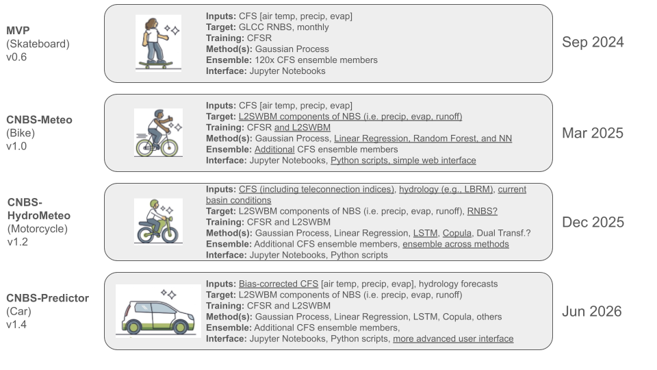

# Project Roadmap

Our project aims to develop increasingly sophisticated tools for predicting key hydrological and meteorological variables, building from foundational models to comprehensive predictive systems. We're committed to continuous improvement, integrating new data sources, methodologies, and user interfaces as we progress.

  

---

## Delivered Versions:

**MVP (Minimum Viable Product) - v0.6**
* **Release Date:** September 2024
* **Description:** This initial "skateboard" version established the core functionality.
* **Inputs:** Utilized **CFS** data including **air temperature, precipitation, and evaporation**.
* **Target:** Focused on **GLCC RNBS**, providing monthly outputs.
* **Training:** Leveraged **CFSR** for model training.
* **Methodology:** Employed **Gaussian Process** for predictions.
* **Ensemble:** Incorporated **120 CFS ensemble members** to enhance robustness.
* **Interface:** Provided through **Jupyter Notebooks** for accessibility.

**CNBS-Meteo (Bike) - v1.0**
* **Release Date:** March 2025
* **Description:** Building on the MVP, this "bike" version significantly expanded our capabilities in meteorological prediction.
* **Inputs:** Continued to use **CFS** data (air temperature, precipitation, evaporation).
* **Target:** Shifted focus to **L2SWBM components of Net Basin Supply (NBS)**, specifically **precipitation, evaporation, and runoff**.
* **Training:** Expanded training data to include both **CFSR and L2SWBM**.
* **Methodology:** Diversified predictive methods by adding **Linear Regression, Random Forest, and Neural Networks** alongside Gaussian Process.
* **Ensemble:** Integrated **additional CFS ensemble members** to improve prediction accuracy.
* **Interface:** Enhanced user interaction with **Jupyter Notebooks, Python scripts, and a simple web interface**.

---

## Upcoming Versions:

**CNBS-HydroMeteo (Motorcycle) - v1.2**
* **Target Release:** December 2025
* **Description:** This "motorcycle" stage will integrate hydrological inputs, leading to more comprehensive forecasts.
* **Expected Inputs:** **CFS** data (including teleconnection indices), **hydrological models (e.g., LBRM)**, and **current basin conditions**.
* **Expected Target:** Focus on **L2SWBM components of NBS** (precipitation, evaporation, runoff), with potential exploration of RNBS.
* **Expected Training:** Continued use of **CFSR and L2SWBM** for training.
* **Expected Methodology:** Further expansion of methods to include **LSTM, Copula, and potentially Dual Transformation**, in addition to Gaussian Process, Linear Regression.
* **Expected Ensemble:** Will incorporate **additional CFS ensemble members** and introduce **ensemble across different methods** for improved reliability.
* **Expected Interface:** Continue to offer **Jupyter Notebooks and Python scripts**.

**CNBS-Predictor (Car) - v1.4**
* **Target Release:** June 2026
* **Description:** The "car" version represents a mature, robust predictive system, incorporating advanced techniques for enhanced accuracy and usability.
* **Expected Inputs:** **Bias-corrected CFS** data (air temperature, precipitation, evaporation) and **integrated hydrology forecasts**.
* **Expected Target:** Will continue to focus on **L2SWBM components of NBS** (precipitation, evaporation, runoff).
* **Expected Methodology:** Will further refine and expand the suite of methods, including **Gaussian Process, Linear Regression, LSTM, Copula, and others** as deemed beneficial.
* **Expected Ensemble:** Will leverage **additional CFS ensemble members**, with ongoing refinement of ensemble strategies.
* **Expected Interface:** Plans include **Jupyter Notebooks, Python scripts, and a more advanced, user-friendly interface** to support broader adoption.